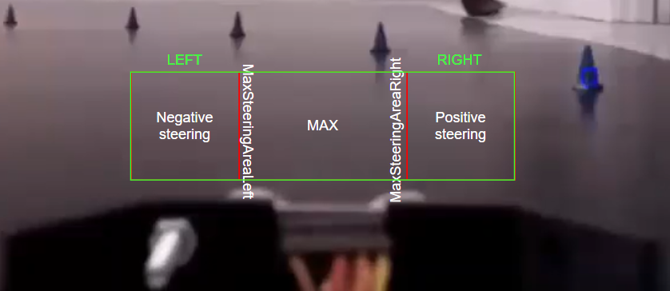
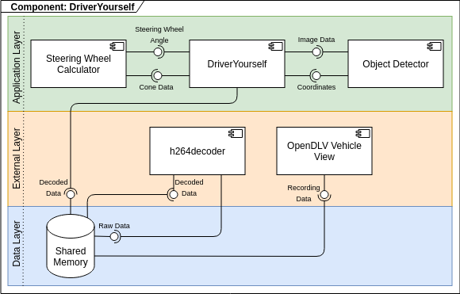

# Group 8 - DriverYourself


This project calculates the steering wheel angle and the algorithm uses the x-coordinate of the first detected cone and a region of interest (ROI) which is a smaller area in front of the car. The algorithm calculates the steering wheel angle based on how close to the center of the region of interest the detected cone is. If the cone is in the center or near the center of the region of interest, the steering wheel angle will be its maximum since it means that the cone is right in front of the car.



## Requirements
### Functional Requirements
1. The system shall use the shared memory area created by opendlv-video-h26-decoder to get new frames coming in.
   1. The system is not allowed to read video files from a file or work on separate image files.
2. The system shall compute the steering wheel angle per new frame based on the information contained in the image frame.
3. The system shall support the `--verbose` command line parameter which should display a debug window with relevant features of the algorithm.
   1. The system shall not display the feature window if the `--verbose` parameter is omitted.
4. The system shall print the following output of the algorithm on the console per frame: `group_08;sampleTimeStamp in microseconds;steeringWheelAngle` where the sample time stamp is the time point from the shared memory area when the frame was captured.
   1. The system shall define, compute and fill the variables sampleTimeStamp and steeringWheelAngle with the values from the shared memory instance and the steering wheel computation of the algorithm.

### Non-Functional Requirements
1. The system shall not crash if there is no graphical user interface available.
2. The system shall be able to integrate with opendlv-vehicle-view.
3. The system shall be able to integrate with h264decoder.
4. The system shall be executable on an Intel/AMD x86_64 platform.
5. The system shall be executable on an ARM platform.
6. The system shall compute the steering wheel angle within +/- 50% of the original steering wheel angle in more than 30% of all video frames contained in the recording that will be used for testing; if the original steering wheel angle is 0, the allowed deviation for calculations is +/-0.05.

## System Requirements
* Ubuntu 18.X
* Docker 20.10.X
* Docker-compose 1.28.X
* g++ 9.3.X
* Git

## Folder Structure
```elm
/include
   root
   external libraries
   header files
/src
   root
   source code files
/test
   root
   source code tests
/modules
   /module name
      /include
         external libraries
         module header files
      /src
         module source code files
      /test
         module tests
```

## Set-up
### Docker Build & Run
**Note:** Restart the DriverYourself application whenever you change recordings.

1. In a terminal, change to the directory with the downloaded recording files
2. In the same terminal, run opendlv-vehicle-view
   1. `docker run --rm --init --net=host --name=opendlv-vehicle-view -v $PWD:/opt/vehicle-view/recordings -v /var/run/docker.sock:/var/run/docker.sock -p 8081:8081 chalmersrevere/opendlv-vehicle-view-multi:v0.0.60`
3. Open opendlv-vehicle-view in Chrome & select a recording to play
   1. `http://localhost:8081`
4. In a new terminal, enable access to the GUI
   1. `xhost +`
5. In the same terminal, run the h264decoder
   1. `docker run --rm -ti --net=host --ipc=host -e DISPLAY=$DISPLAY -v /tmp:/tmp h264decoder:v0.0.4 --cid=253 --name=img`
6. Play the recording (if you haven't already) to add data to the shared memory
7. In a new terminal, clone repository into a directory of your choosing using SSH
   1. `git clone git@git.chalmers.se:courses/dit638/students/2021-group-08.git`
8. In the same terminal, change directory to the repository
   1. `cd 2021-group-08`
9. In the same terminal, build the repository
   1. `docker build -f Dockerfile -t driveryourself:latest .`
10. In the same terminal, run DriverYourself & play the recording in Chrome
    1. `docker run --rm -ti --net=host --ipc=host -e DISPLAY=$DISPLAY -v /tmp:/tmp driveryourself:latest --cid=253 --name=img --width=640 --height=480 --verbose`

### Manual Build
1. Clone repository into a directory of your choosing using SSH
`git clone git@git.chalmers.se:courses/dit638/students/2021-group-08.git`
2. Change directory to the repository
   1. `cd 2021-group-08`
3. Create build directory
   1. `mkdir build`
4. Change to build repository
   1. `cd build`
5. Build software
   1. `cmake ..`
   2. `make`
6. To run the test suites 
   1. `make test`
 
## Workflow
### Add new features
1. Add Trello card
2. Create issue in gitlab
   1. Add issue to related milestone
3. Create new branch for new feature
   1. Only functioning code in master branch
   2. Code Review: Team member with least possible involvement reviews committed code for new feature
4. Update corresponding Trello card with new status
5. Features will be merged into a branch when they are completed & CI passes
   1. At least one member approves of the completed feature
   2. Rebasing from master will be used when needed

### Bugfixes
1. Add Trello card
2. Create issue in gitlab
3. If bug is discovered after feature has been committed to master: create new branch for bug fixing
4. If bug is discovered while working in a branch for a new feature: continue in existing branch and fix the bug before committing branch to master
5. Update corresponding Trello card with new status
6. Team member with least possible involvement reviews committed code for bug fix

### Commit messages
Adapted from: https://chris.beams.io/posts/git-commit/

#### Style
* Short subject line
* Capitalize beginning of subject line
* No period at the end of subject line
* Imperative mood in the subject line
* Use tags in the beginning of the subject line
   * [FIX]
   * [IMPLEMENT]
   * [INIT]
   * [TEST]

#### Content
* What, why and how
   * What: feature, bug, method names
   * Why: bugfix, explains why you solved it this way
   * How: briefly how it was implemented
* At least 1 sentence or 1 mention

#### Metadata
* Co-author tag used when pair programming or collaborating
   * Add to top of message, under the subject line (see example)
* Issue tracking ID (“Resolves issue #$”)
* We plan to merge into a branch rather than rebasing

##### Example
```
[IMPLEMENT] Summarize changes in around 50 characters or less

Co-authored-by: chalmersid <chalmersid@student.chalmers.se>

More detailed explanatory text, if necessary. Wrap it to about 72
characters or so. In some contexts, the first line is treated as the
subject of the commit and the rest of the text as the body. The
blank line separating the summary from the body is critical (unless
you omit the body entirely); various tools like `log`, `shortlog`
and `rebase` can get confused if you run the two together.

Explain the problem that this commit is solving. Focus on why you
are making this change as opposed to how (the code explains that).
Are there side effects or other unintuitive consequences of this
change? Here's the place to explain them.

Resolves: #123
```
